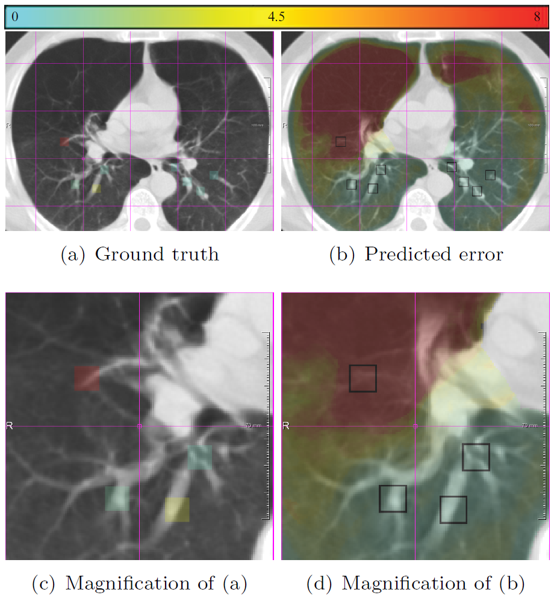

RegUn: Registration Uncertainty

## Introduction
Predicting registration error can be useful for evaluation of registration procedures, which is important for the adoption of registration techniques in the clinic. In addition, quantitative error prediction can be helpful in improving the registration quality. This work proposes a new automatic method to predict the registration error in a quantitative manner, and is applied to chest CT scans. A random regression forest is utilized to predict the registration error locally. The forest is built with features related to the transformation model and features related to the dissimilarity after registration.

<body style="text-align: center;">

</body>

Figure 1: An example of RegUn.

### Citation
[1] Sokooti, H., Saygili, G., Glocker, B., Lelieveldt, B. P., & Staring, M. (2016, October). Accuracy estimation for medical image registration using regression forests. In International Conference on Medical Image Computing and Computer-Assisted Intervention (pp. 107-115). Springer, Cham.

## 1. Dependencies
- [numpy](http://www.numpy.org/) : General purpose array-processing package.
- [SciPy](https://www.scipy.org/) : A Python-based ecosystem of open-source software for mathematics, science, and engineering.
- [SimpleITK](http://www.simpleitk.org/) : Simplified interface to the Insight Toolkit for image registration and segmentation.
- [TBB](https://www.threadingbuildingblocks.org): Lets you easily write parallel C++ programs that take full advantage of multicore performance

## 2. Running RegUn
Check `uncertainty.py`

### 2.1 Perform Registration:
In order to run registration, runnig  `do_elastix_registration.py` or  `do_ANTs_registration.py` is easier. Later the script  `uncertainty.py` can read the registration results. 

An example of registration paramater for elastix and ANTs package is available at: 

`Elastix/DIR-Lab_COPD/elastix1/parameter/` and 

`Elastix/DIR-Lab_COPD/ANTs1/parameter/`.

### 2.2 Reading Images

All of the addressess (images, results, etc) can be modified in  `Functions/Python/setting_utils.py`. 

### 2.3 Pooling
In order to calculate max-pooling, average-pooling and normalized mutual information, the binary versions are available at: `Functions/Python/EXE/`. 
